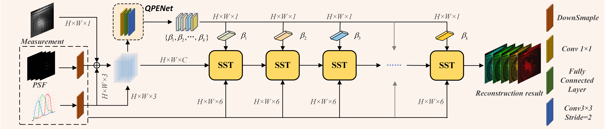
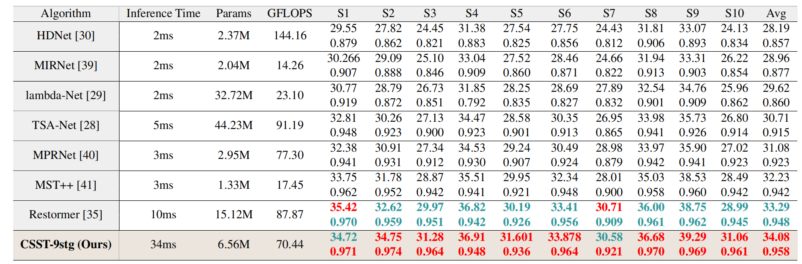

# CSST--Reconstruction-Algorithm-of-Aperture-Diffraction-Imaging-Spectrometer

More general experimental results under different exposure conditions are that the **CSST-9stg** can **improve close to 1.5 dB in PSNR** over the **Restormer** on the task of ADIS reconstruction.

Notably, the algorithm can be used to solve the inverse problem of PSF engineering and RGB super-resolution.

**This toolkit will be continually refined.**


## 1. Result:




**A more general result is that the CSST-9stg exhibits around 35dB in PSNR.**

&nbsp;


## 2. Create Environment:

- Python 3 (Recommend to use [Anaconda](https://www.anaconda.com/download/#linux))

- NVIDIA GPU + [CUDA](https://developer.nvidia.com/cuda-downloads)

- Python packages:

```shell
  pip install -r requirements.txt
```


&nbsp;


## 3. Prepare Dataset:
Download cave_1024_28 ([Baidu Disk](https://pan.baidu.com/s/1X_uXxgyO-mslnCTn4ioyNQ), code: `fo0q` | [One Drive](https://bupteducn-my.sharepoint.com/:f:/g/personal/mengziyi_bupt_edu_cn/EmNAsycFKNNNgHfV9Kib4osB7OD4OSu-Gu6Qnyy5PweG0A?e=5NrM6S)), CAVE_512_28 ([Baidu Disk](https://pan.baidu.com/s/1ue26weBAbn61a7hyT9CDkg), code: `ixoe` | [One Drive](https://mailstsinghuaeducn-my.sharepoint.com/:f:/g/personal/lin-j21_mails_tsinghua_edu_cn/EjhS1U_F7I1PjjjtjKNtUF8BJdsqZ6BSMag_grUfzsTABA?e=sOpwm4)), KAIST_CVPR2021 ([Baidu Disk](https://pan.baidu.com/s/1LfPqGe0R_tuQjCXC_fALZA), code: `5mmn` | [One Drive](https://mailstsinghuaeducn-my.sharepoint.com/:f:/g/personal/lin-j21_mails_tsinghua_edu_cn/EkA4B4GU8AdDu0ZkKXdewPwBd64adYGsMPB8PNCuYnpGlA?e=VFb3xP)), and then put them into the corresponding folders of `datasets/` .

```shell
|--CSST
    |--Real
    	|-- test_code
    	|-- train_code
    |--simulation
    	|-- train_code
    |--tools
    |--datasets
        |--cave_1024_28
            |--scene1.mat
            |--scene2.mat
            ：  
            |--scene205.mat
        |--KAIST_CVPR2021_selected 
            |--1.mat
            |--2.mat
            ： 
            |--20.mat
        |--KAIST_CVPR2021_unselected 
            |--1.mat
            |--2.mat
            ： 
            |--10.mat

```

we use the CAVE dataset (cave_1024_28) and KAIST (KAIST_CVPR2021_selected) (10 secnes of KAIST_CVPR2021_unselected are croped as testset) as the simulation training set. Both the CAVE (CAVE_512_28) and KAIST (KAIST_CVPR2021) datasets are used as the real training set. 

We will soon make available the training and test sets used in the paper implementation.


&nbsp;


## 4. Simulation Experiement:

### 4.1　Training

```shell
# first step
cd CSST/tools
python gen_gt_mea.py

# second step
python train.py --template CSST-3stg --outf ./exp/CSST-3stg/ --method CSST-3stg
python train.py --template CSST-5stg --outf ./exp/CSST-5stg/ --method CSST-5stg
python train.py --template CSST-7stg --outf ./exp/CSST-7stg/ --method CSST-7stg
python train.py --template CSST-9stg --outf ./exp/CSST-9stg/ --method CSST-9stg 
```

The training log, trained model, and reconstrcuted HSI will be available in `CSST/simulation/train_code/exp/` . 


### 4.2　Testing
By loading model weights in such a way that you can quickly implement model testing from the training code


### 4.3 Evaluating the Params and FLOPS of models

  We have provided a function `my_summary()` in `simulation/train_code/utils.py`, please use this function to evaluate the parameters and computational complexity of the models, especially the Transformers as 

```shell
from utils import my_summary
my_summary(CSST(), 256, 256, 28, 1)
```


&nbsp;


## 5. Real Experiement:

### 5.1　Training

```shell
# first step
cd CSST/Real/train_code
python create_dataset.py

# second step
python train.py --template CSST-3stg --outf ./exp/CSST-3stg/ --method CSST-3stg
python train.py --template CSST-5stg --outf ./exp/CSST-5stg/ --method CSST-5stg
python train.py --template CSST-7stg --outf ./exp/CSST-7stg/ --method CSST-7stg
python train.py --template CSST-9stg --outf ./exp/CSST-9stg/ --method CSST-9stg 
```

The training log, trained model, and reconstrcuted HSI will be available in `CSST/Real/train_code/exp/` . 


### 5.2　Testing

```shell
# first step
cd CSST/Real/test_code
python test_CSST_final.py
```

&nbsp;


## 6. Citation
If this repo helps you, please consider citing our works:


```shell
# ADIS+CSST
@inproceedings{lv2023aperture,
  title={Aperture Diffraction for Compact Snapshot Spectral Imaging},
  author={Lv, Tao and Ye, Hao and Yuan, Quan and Shi, Zhan and Wang, Yibo and Wang, Shuming and Cao, Xun},
  booktitle={Proceedings of the IEEE/CVF International Conference on Computer Vision},
  pages={10574--10584},
  year={2023}
}
```


